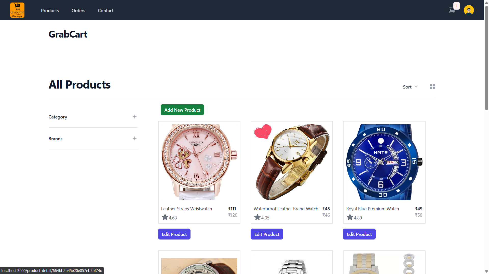
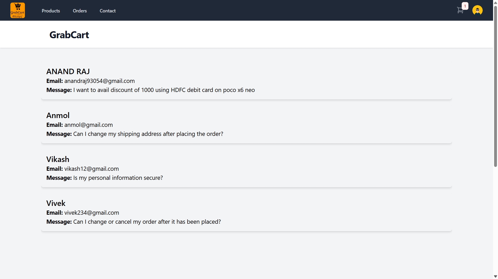

# eCommerce_MERN_app 🛒

## Version 1
- Data stored using MongoDB.
- Reduxstore used for payment and order information.
- The admin panel allows the administrator to manage orders and issues. The features include:

- Accessing all orders and issues.
- Changing the status of orders and issues.
- Adding and removing products.

E-commerce platform developed with React JS, Redux, Tailwind CSS, Router, ExpressJS, MongoDB, (dummy payment gateway temporarily).
   [Admin Live](https://grabcart.vercel.app/)


### Features:
#### Admin Panel
1. **Product Management:** 
	- Add, edit, or remove products easily.
	- View and update product details, including title, description, price, and inventory.
2. **Order Analytics:** 
	- Access a comprehensive list of customer orders.
	- View order details, including products, quantities, and customer information.
3. **Admin Authorization:**
	- Checking user authorization from using server.

---

## Screenshots:

### Order info

<!--  -->

### Sign-in & Sign-Up Page


<!--  -->

### Product Section



<!-- 

### User Issue

<!-- 


---

## Developed With:
- [Visual Studio Code](https://code.visualstudio.com/)
- [React](https://reactjs.org/)
- [Create React App](https://create-react-app.dev/)
- [ExpressJS](https://expressjs.com/)
- [NodeJS](https://nodejs.org/en)
- [MongoDB](https://www.mongodb.com/atlas/database)

---

## Getting Started:

### Prerequisites:
- Node v20.11.1
- Npm 10.2.4

Verify your node and npm versions:
```bash
node -v
npm -v